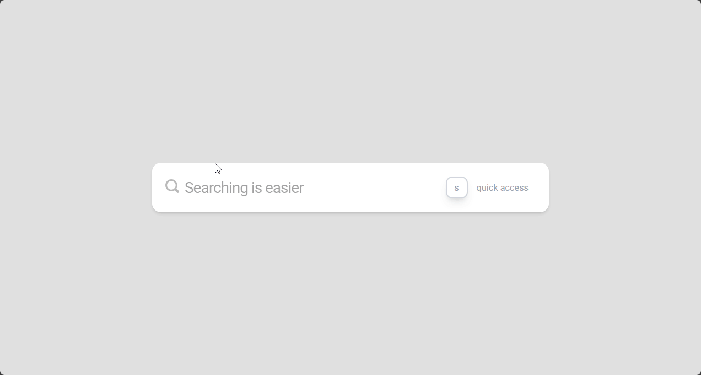

# 🔍 Search Results Animation (Dribbble Inspired)

This is a **React + Vite** project showcasing a clean and minimal search bar animation inspired by a Dribbble design.  
The demo highlights smooth UI/UX transitions using **Material UI**, **TailwindCSS**, and modern React libraries.




---

## ✨ Features

- 🎨 Dribbble-inspired search bar design
- ⚡ Built with **React 19 + Vite** for blazing fast dev experience
- 🎭 Smooth animations and clean UI
- 🧩 Styled with **Material UI + TailwindCSS**
- 📦 Easy to extend for real search functionality

---

## 🚀 Getting Started

### 1. Clone the repository

```bash
git clone https://github.com/your-username/search-results-animation.git
cd search-results-animation
```
